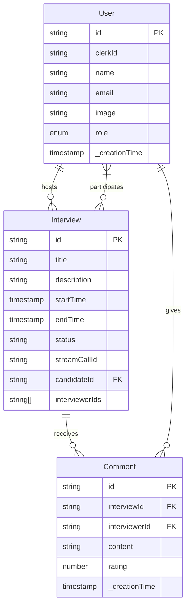
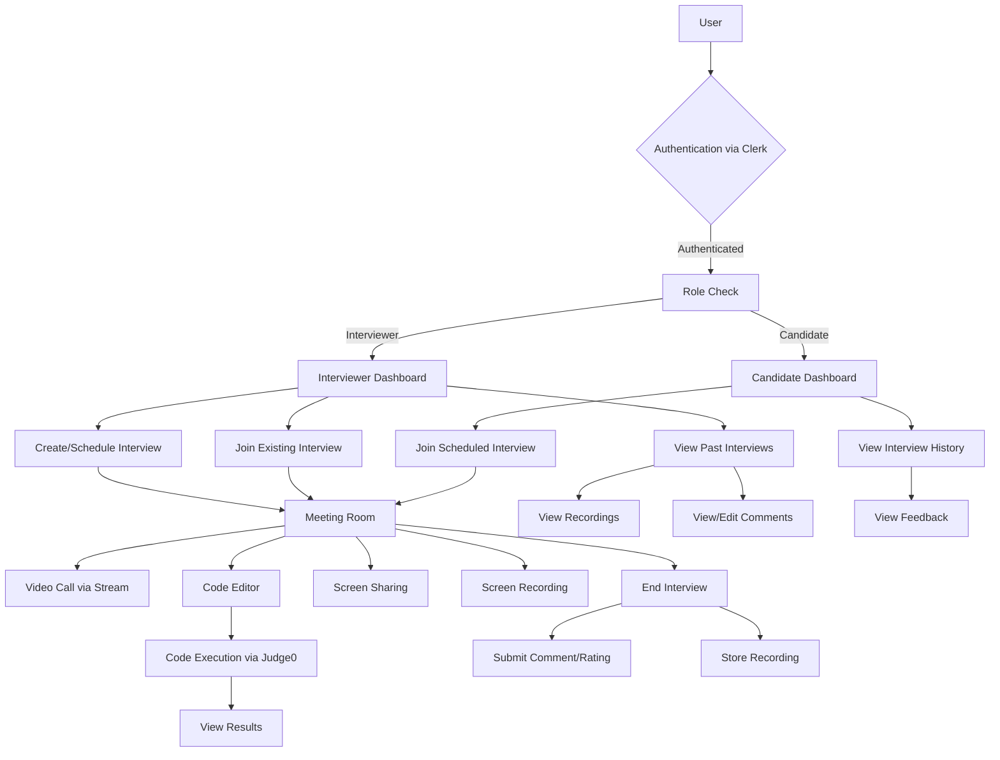
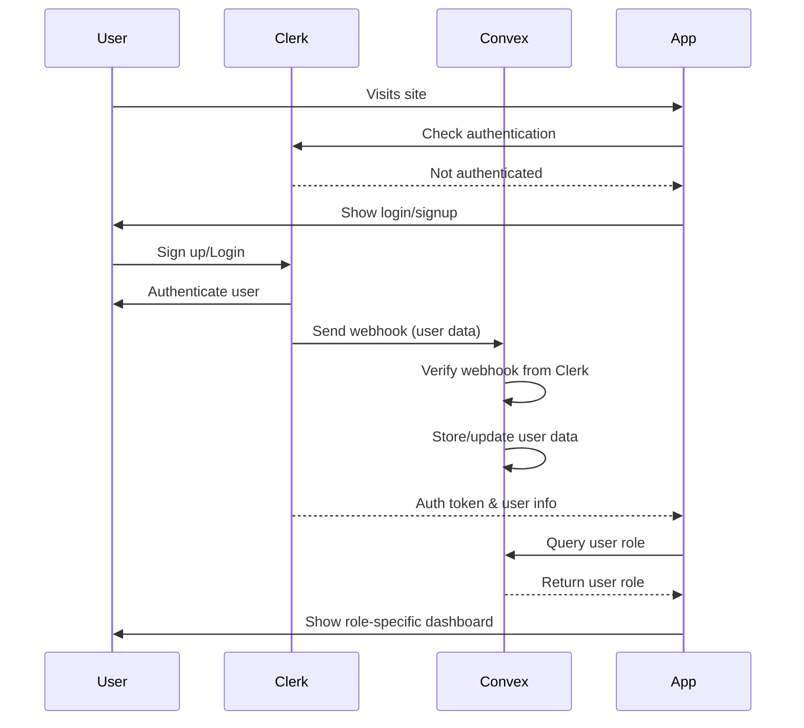
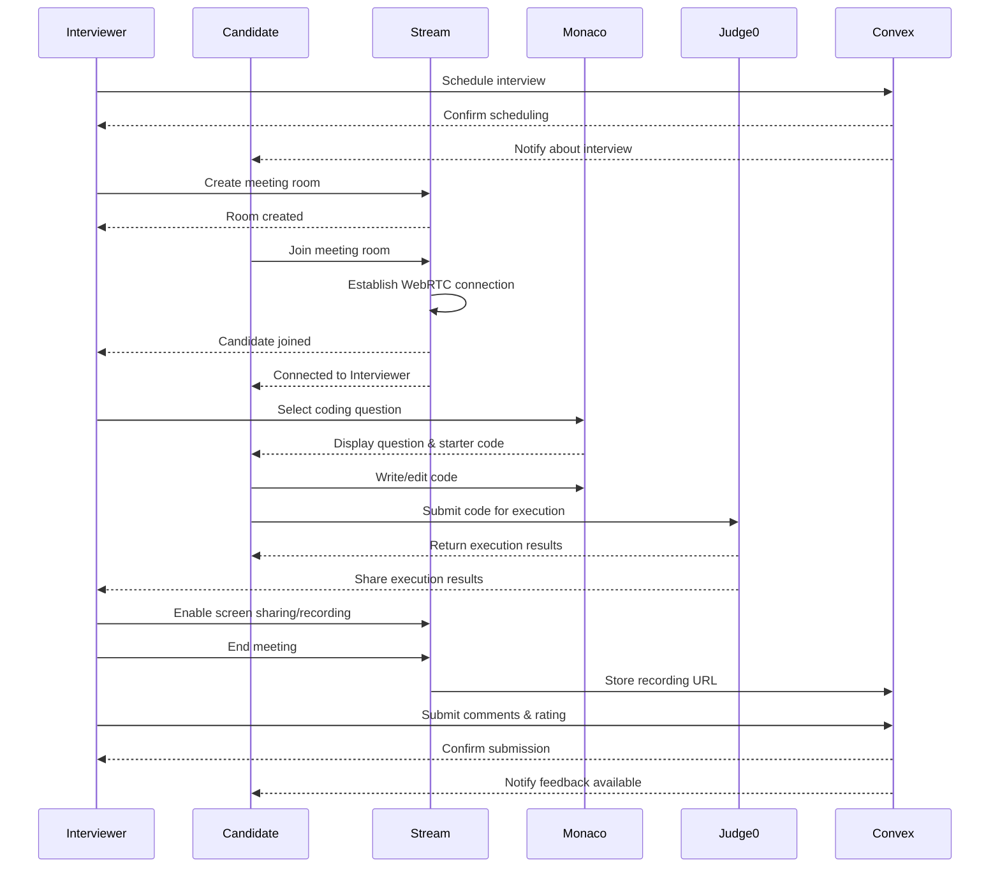
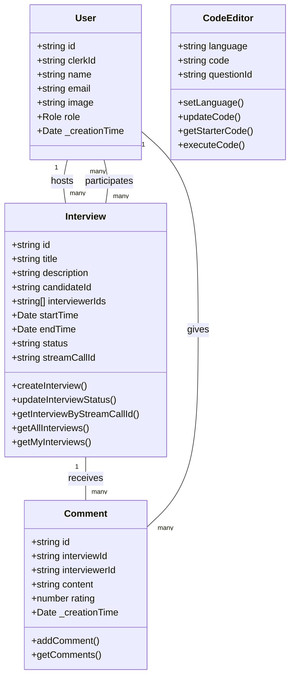

# ✨ PIXYCODE

**PIXYCODE** is a modern full-stack technical interview platform designed to streamline real-time coding interviews with seamless collaboration tools, live code execution, video communication, and structured evaluation workflows.

Built for recruiters, interviewers, and developers, PIXYCODE creates an interactive interview environment that closely replicates real-world technical assessments.

---

# 🚀 Features

## 🎥 Real-Time Video Communication

Powered by Stream API, PIXYCODE enables high-quality real-time audio and video communication between interviewers and candidates. The platform supports multi-user participation with stable low-latency connections for smooth interview experiences.

---

## 🖥️ Screen Sharing & Session Recording

Interviewers can share their screens for walkthroughs, debugging sessions, or explanations during interviews. Entire interview sessions can also be recorded for later review and hiring analysis.

---

## 🔐 Secure Authentication

PIXYCODE uses Clerk Authentication to provide secure and scalable user management with:

- Email/password authentication
- Protected routes
- Session management
- Role-based access control
- Secure webhook synchronization

---

## 💻 Advanced Code Editor

The platform integrates Monaco Editor — the same editor that powers VS Code — delivering a professional coding experience with:

- Syntax highlighting
- Multi-language support
- Intelligent auto-completion
- Error indicators
- Customizable themes
- Line numbering

---

## ⚡ Real-Time Code Execution

Using the Judge0 API, candidates can execute code instantly in multiple languages, including:

- JavaScript (Node.js)
- Python
- Java
- C++
- C

Execution output, runtime errors, and compilation results are shared in real time with both interviewer and candidate.

---

## 📅 Interview Management System

Interviewers can efficiently manage technical interviews by:

- Scheduling interview sessions
- Inviting multiple interviewers
- Assigning coding problems
- Rating candidate performance
- Leaving detailed feedback
- Marking interviews as passed or failed

---

## 📊 Dashboard & Analytics

PIXYCODE includes a clean and intuitive dashboard where users can manage:

- Upcoming interviews
- Completed sessions
- Passed/failed interviews
- Interview recordings
- Historical performance reviews
- Candidate feedback

---

# 🛠️ Tech Stack

| Category                | Technology                                      |
| ----------------------- | ----------------------------------------------- |
| Frontend                | Next.js 14, TypeScript, Tailwind CSS, shadcn/ui |
| Authentication          | Clerk                                           |
| Backend & Database      | Convex                                          |
| Real-Time Communication | Stream (WebRTC)                                 |
| Code Execution          | Judge0 API                                      |
| Code Editor             | Monaco Editor                                   |

---

# 📐 System Architecture & Diagrams

## ER Diagram

---

## System Flow Diagram

---

## Authentication Flow

---

## Interview Session Flow

---

## UML Class Diagram

---

# 🔄 How PIXYCODE Works

## 👤 User Authentication & Role Management

When users access PIXYCODE, Clerk securely handles authentication and identity verification. After successful login/signup, user data is synchronized with Convex using secure webhooks.

Users are then redirected to dashboards based on their assigned roles:

- **Interviewers** → Manage and conduct interviews
- **Candidates** → Join interviews and view feedback

---

## 📅 Interview Scheduling Workflow

Interviewers can create interview sessions by:

- Selecting candidates
- Setting interview dates & times
- Inviting additional interviewers
- Creating interview descriptions
- Generating Stream meeting rooms

All interview information is stored in Convex and automatically reflected in the candidate dashboard.

---

## 💻 Live Coding Experience

Inside the interview room, candidates gain access to a fully interactive coding environment powered by Monaco Editor.

Features include:

- Real-time code editing
- Multi-language execution
- Instant output rendering
- Shared execution visibility
- Collaborative technical evaluation

Code execution requests are processed through Judge0 API.

---

## 🎥 Interview Collaboration Tools

During sessions, users can:

- Communicate via live video/audio
- Share screens
- Record meetings
- Collaboratively review solutions
- Switch between speaker/grid layouts

This creates a realistic technical interview environment similar to remote engineering interviews used in the industry.

---

## ⭐ Feedback & Evaluation System

Once the interview ends, interviewers can:

- Leave detailed comments
- Rate candidate performance
- Mark interview outcomes
- Review recordings later

Candidates can access feedback directly from their dashboards.

---

# 🔄 Complete Application Workflow

## 1️⃣ User Registration

- User signs up using Clerk
- Clerk verifies identity
- Webhooks synchronize user data with Convex
- User role is assigned
- Dashboard access is granted

---

## 2️⃣ Interview Creation

Interviewers:

- Create interviews
- Add participants
- Select schedules
- Generate Stream meeting rooms
- Store interview metadata in Convex

---

## 3️⃣ Interview Session

Participants:

- Join virtual meeting rooms
- Configure devices
- Start video communication
- Begin coding assessment

---

## 4️⃣ Code Evaluation

Candidates:

- Solve coding questions
- Execute solutions
- Debug in real time
- Share outputs with interviewers

---

## 5️⃣ Recording & Feedback

The platform:

- Records sessions
- Stores recordings
- Saves interview feedback
- Updates interview status

---

## 6️⃣ Dashboard Review

Users can later:

- Access recordings
- Review interview history
- Analyze feedback
- Track performance metrics

---

# 🌟 Why PIXYCODE?

PIXYCODE combines real-time communication, collaborative coding, secure authentication, and structured evaluation into one unified platform — making technical interviews smoother, faster, and more efficient for both interviewers and candidates.

---
